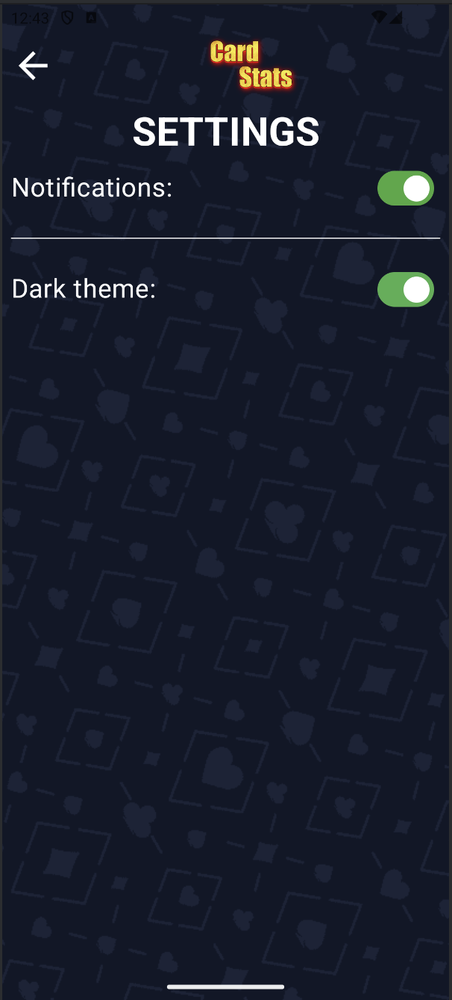

# CardStats 🎴

**CardStats** is a comprehensive tool for analyzing and tracking card game results. Perfect for players who want to improve their skills, maintain game statistics, record strategies, and track wins and losses.

## Features ⚡

### 📅 Game Calendar
- **Game Journal**: Track date, game name (poker, bridge, rummy, etc.), participants, and results
- **Color-coded Days**:
    - 🟢 Green: More successful sessions
    - 🔴 Red: More losing sessions
    - ⚫ Black: Inactive days
- **Detailed Day View**: Tap any day to see game results and participants

### 📊 Player Statistics
- **Performance Analysis**: Total wins/losses, average results per game, best day/month
- **Dynamic Charts**: Visual representation of wins and losses over time
- **Win Rate**: Percentage-based frequency analysis

### 🎯 Games & Rules Library
- Pre-loaded list of popular card games with brief rules
- Add custom games with personalized rules
- Easy game management and editing

### 📝 Strategy Notes
- Record strategies and game notes
- Attach notes to specific games or dates
- Build your personal knowledge base

### 🏆 Tournament Mode
- Create tournament brackets with participant management
- Automatic score tracking and winner calculation
- Comprehensive tournament statistics

### ⚙️ Customizable Settings
- Game categories (friends, online, tournaments)
- Dark/Light theme support
- Notification preferences

## Screenshots 📱

| **Main Menu**                      |
|------------------------------------|
|  |

| **Add Game**                          |
|---------------------------------------|
|  |

| **Calendar View**                     |
|---------------------------------------|
|  |

| **Games Library**               |
|---------------------------------|
|  |

| **Statistics**                            |
|-------------------------------------------|
|  |

| **Add Tournament**                                |
|---------------------------------------------------|
|  |

| **Tournaments**                             |
|---------------------------------------------|
|  |

| **Settings**                          |
|---------------------------------------|
|  |

## App Screens Overview 🎯

### Main Screen
- Player statistics overview (wins, losses, successful days)
- Quick actions: "Add Game", "My Statistics", "Tournament"

### Calendar
- View games for selected periods
- Add and edit game entries with intuitive interface

### Statistics
- Interactive charts showing wins/losses trends
- Performance tables highlighting best and worst days

### Games Library
- Comprehensive list of card games with descriptions
- Add new games and customize existing ones

### Tournaments
- Create and manage tournaments with ease
- Automatic participant scoring and winner determination

### Settings
- Notification management
- Theme customization (Dark/Light mode)
- Personal preferences configuration

## Tech Stack 🛠️

- **Language**: Kotlin
- **UI Framework**: Jetpack Compose
- **Architecture**: MVVM with Compose Navigation
- **Database**: Room Database
- **Dependency Injection**: Koin
- **Data Storage**: DataStore Preferences
- **Date/Time**: Kotlinx DateTime
- **Charts**: MPAndroidChart
- **UI Components**: Material 3
- **Build Tools**: Kotlin Symbol Processing (KSP)

### Key Technologies
- Jetpack Compose
- Room for local DB
- DateTime Wheel Picker for intuitive date selection
- DataStore for lightweight preference storage
- 
## License 📄

This project is open source and available under the [MIT License](LICENSE).

---

*Happy gaming and may the cards be in your favor! 🍀*